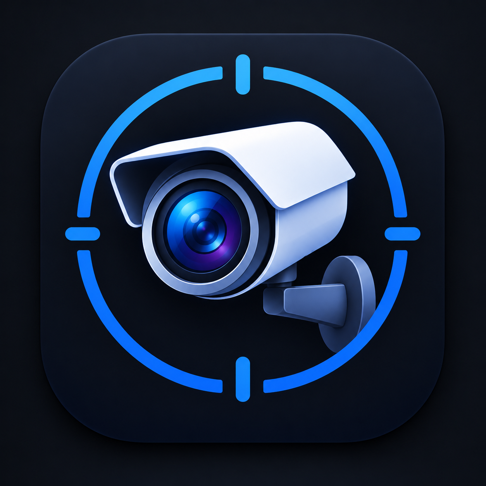

<p align="center">
  
</p>

<h1 align="center">SentriCam</h1>

<p align="center">
  <a href="https://github.com/4lanPz/SentriCam/releases/latest"></a>
  <a href="https://github.com/4lanPz/SentriCam/releases"></a>
  <a href="https://github.com/4lanPz/SentriCam/stargazers"></a>
  
  <a href="LICENSE"></a>
</p>

<p align="center">
  <b>Español</b> · <a href="README.en.md">English</a>
</p>

<p align="center">
  Visor de cámaras de DVR y NVR Hikvision para Android TV.<br>
  Ve en la TV solo las cámaras que te interesan, de uno o varios equipos, en una cuadrícula por páginas.
</p>

---

## ¿Qué es?

SentriCam es una app para Android TV (también funciona en tablets y celulares Android) que muestra en vivo las cámaras de tus DVR/NVR Hikvision por RTSP.

Está pensada para instalaciones con infraestructura cerrada y local con muchas cámaras en las que la TV solo necesita mostrar algunas: eliges qué cámaras ver, se reparten en páginas y la TV solo reproduce las de la página visible, así funciona bien incluso en equipos modestos.

Todo funciona **dentro de tu red local**: la app no usa servidores externos, ni cuentas en la nube, ni internet.

## Características

- **Varios DVR a la vez**: agrega todos los DVR/NVR que necesites.
- **Nombres automáticos**: la app le pregunta a cada DVR qué canales tiene y usa los nombres que ya tienen puestos las cámaras. No hay que escribirlos.
- **Cuadrícula por páginas**: 1, 4, 6, 9 o 16 cámaras por página.
- **Cambio automático de página** (opcional) cada cierto tiempo, con botón para pausarlo.
- **Grupos**: junta cámaras de distintos DVR en una misma vista (por ejemplo, todas las de un piso) y elige en la TV qué ver: todo, un grupo o un solo DVR.
- **Pantalla completa** en calidad principal al seleccionar una cámara.
- **Configuración desde el navegador**: la TV muestra una dirección y un código; desde una computadora o celular en la misma red llenas un formulario. No hace falta escribir con el control remoto.
- **Prueba de conexión** por DVR: indica si el puerto de video, el usuario/contraseña y los canales están bien, con mensajes claros en español.
- **Pensada para el control remoto**: todo se maneja con las flechas y el botón central.
- **PIN opcional** para proteger la app y su configuración.
- **Ligera**: reproduce solo la página visible, sin audio y con poca memoria por cámara, para TV antiguas o de gama baja.

## Requisitos

- **Android 7.0 o superior** (Android TV, TV box, tablet o celular).
- DVR o NVR **Hikvision** (o compatible) con **RTSP** activado, en la misma red local que la TV.
- Para los nombres automáticos de las cámaras, el DVR debe tener la web activa (puerto 80, ISAPI). Si no la tiene, igual puedes escribir los números de canal a mano.

> Algunos DVR muy antiguos no tienen RTSP (solo se ven con iVMS/SDK); esos no son compatibles.

## Instalación

1. Descarga el APK desde la sección [**Releases**](../../releases/latest). Hay tres opciones:

   | Archivo | Para qué equipo |
   |---|---|
   | `SentriCam-...-armeabi-v7a.apk` | La mayoría de Android TV y TV box, sobre todo las antiguas (32 bits). |
   | `SentriCam-...-arm64-v8a.apk` | Equipos más nuevos (64 bits). |
   | `SentriCam-...-universal.apk` | Funciona en cualquiera, pero pesa unas tres veces más. |

   Si no sabes cuál usar, instala el universal. Con `adb` puedes averiguarlo: `adb shell getprop ro.product.cpu.abi`.

2. Instálalo en la TV de alguna de estas formas:
   - **Con una memoria USB** y un administrador de archivos en la TV (hay que permitir "orígenes desconocidos").
   - **Con adb** desde una computadora en la misma red (activa la depuración en las opciones de desarrollador de la TV):
     ```bash
     adb connect IP_DE_LA_TV
     adb install -r SentriCam-...-armeabi-v7a.apk
     ```
   - **Por la red (más rápido)**: comparte el APK por SMB o FTP y ábrelo en la TV con una app como CX File Explorer para instalarlo directamente.

## Primera configuración

1. Abre SentriCam en la TV. Aparece la pantalla **Configurar cámaras** con una dirección (por ejemplo `http://192.168.1.50:8080`) y un **código de 6 dígitos**.
2. Desde una computadora o celular **conectado a la misma red**, abre esa dirección en el navegador y escribe el código.
3. En **DVRs**, llena una fila por cada equipo:
   - **Nombre**: como quieras llamarlo (por ejemplo "Bodega").
   - **IP** del DVR.
   - **Puerto**: el de video RTSP, normalmente `554`.
   - **Usuario** y **contraseña** del DVR.
   - **Canales**: vacío para todos, o por ejemplo `1-8, 12`. Los nombres se toman del DVR.
4. Pulsa **Probar** para comprobar la conexión y luego **Guardar** para dejar el DVR en la lista. Repite con cada DVR.
5. (Opcional) Crea **grupos** marcando las cámaras de cada uno.
6. En **Pantalla**, elige cuántas cámaras por página, el cambio automático de página, la calidad y un PIN si lo quieres.
7. Pulsa **Guardar configuración en la TV**. La TV empieza a mostrar las cámaras.

Para cambiar algo después, entra a la configuración desde el engrane de la barra superior (o la tecla menú del control) y repite el proceso. Por seguridad, el acceso desde el navegador se cierra solo a los 10 minutos o al salir de esa pantalla.

## Uso con el control remoto

| Tecla | Acción |
|---|---|
| Flechas | Moverse entre cámaras. En el borde izquierdo o derecho cambia de página. |
| Botón central | Ver la cámara en pantalla completa. |
| Atrás | Salir de pantalla completa. |
| CH+ / CH− (o Página arriba/abajo) | Página siguiente o anterior. |
| Menú | Abrir la configuración. |
| Flecha arriba (desde la primera fila) | Barra superior: páginas, pausar el cambio automático, elegir grupo o DVR, administrar DVRs y configuración. |

En pantallas táctiles también puedes cambiar de página deslizando hacia los lados.

## Recomendaciones

- **Crea un usuario solo para ver** en cada DVR (permiso de vista en vivo y solo los canales necesarios) y úsalo en la app, en lugar del administrador.
- **Usa la calidad baja (substream)** en la cuadrícula: es la opción por defecto y es la que permite ver varias cámaras a la vez con fluidez.
- **Para que las cámaras aparezcan más rápido** al cambiar de página, configura en el DVR el *intervalo de I-frame* del substream igual a los FPS (por ejemplo 15 si graba a 15 fps).
- **Cuidado con las contraseñas equivocadas**: los Hikvision bloquean la IP que falla varias veces seguidas durante unos 30 minutos. La app no reintenta cuando la contraseña es rechazada, para no provocar ese bloqueo.

## Seguridad y privacidad

- El APK **no contiene ninguna contraseña**. Los datos de los DVR se ingresan desde el navegador y se guardan **cifrados** en la TV (almacenamiento seguro de Android).
- El acceso de configuración solo funciona mientras esa pantalla está abierta, pide un código de 6 dígitos, acepta únicamente equipos de la red local y **nunca devuelve contraseñas**.
- La app solo acepta DVR con IP de red local.
- Limitaciones conocidas: la configuración viaja por HTTP dentro de tu red al guardarla, y el video RTSP de los DVR no va cifrado. Por eso la app está pensada solo como una alternativa rápida para redes locales.

## Diagnóstico desde la computadora

`tool/probar_dvr.py` prueba un DVR desde la PC, haciendo lo mismo que la app: busca el puerto RTSP, prueba usuario y contraseña, consulta los canales y comprueba que llegue video. Solo necesita Python 3 (sin librerías extra) y pide la contraseña sin mostrarla.

```bash
python tool/probar_dvr.py 192.168.1.64 -u usuario
python tool/probar_dvr.py 192.168.1.64 -u usuario --canal 3
python tool/probar_dvr.py 192.168.1.64 --escanear    # busca RTSP en todos los puertos
```

## Compilar desde el código

Requiere [Flutter](https://flutter.dev) 3.41 o superior y el SDK de Android.

```bash
flutter pub get
flutter analyze
flutter test
flutter build apk --release --split-per-abi --obfuscate --split-debug-info=build/simbolos
```

Los APK quedan en `build/app/outputs/flutter-apk/`.

**Firma**: si existe `android/key.properties`, el APK de release se firma con tu llave; si no, se usa la llave de depuración. Para usar la tuya, crea ese archivo (no se sube al repositorio):

```properties
storeFile=ruta/a/tu-llave.jks
storePassword=...
keyAlias=...
keyPassword=...
```

> Un APK firmado con otra llave no se puede instalar encima del de Releases: primero hay que desinstalar la app (y volver a configurarla).

**Configuración de ejemplo**: `config/config.ejemplo.json` muestra el formato completo. Durante el desarrollo puedes copiarlo a `config/config.local.json` (ignorado por git), llenarlo y enviarlo a la TV con:

```bash
dart run tool/cargar_config.dart IP_DE_LA_TV CODIGO
```

**Iconos**: el icono original está en `assets/icono/SentriCam.png`. Si lo cambias, regenera los iconos de Android con `python tool/generar_iconos.py` (requiere Pillow).

## Estructura del proyecto

```
lib/
  main.dart               Arranque y pantalla inicial
  modelos.dart            Configuración, DVR, cámaras, grupos y validación
  almacen.dart            Guardado cifrado de la configuración
  hikvision.dart          Consulta de canales, autenticación y pruebas de conexión
  servidor_config.dart    Servidor temporal de configuración (puerto 8080)
  pagina_web.dart         Formulario web de configuración
  importar.dart           Pantalla "Configurar cámaras"
  cuadricula.dart         Cuadrícula paginada y navegación con el control
  vista_camara.dart       Reproductor RTSP de cada cámara
  administrar_dvrs.dart   Lista de DVR y prueba de conexión en la TV
  pin.dart                Pantalla de PIN
test/                     Pruebas automáticas
tool/                     Herramientas para la PC (diagnóstico, carga de configuración, iconos)
config/                   Configuración de ejemplo
assets/icono/             Icono original de la app
android/                  Proyecto Android
```

Construida con [Flutter](https://flutter.dev) y [media_kit](https://github.com/media-kit/media-kit) (mpv/FFmpeg), con ayuda de [Claude Code](https://claude.com/claude-code).

## Licencia

SentriCam es **software libre** bajo la [licencia MIT](LICENSE): puedes usarlo, copiarlo, modificarlo y compartirlo libremente, también con fines comerciales, siempre que conserves el aviso de copyright. Se entrega tal cual, sin garantías.

SentriCam no está afiliado a Hikvision. Hikvision e iVMS son marcas de sus respectivos dueños.

---

<p align="center">Desarrollada por <b>4lanpz</b></p>
